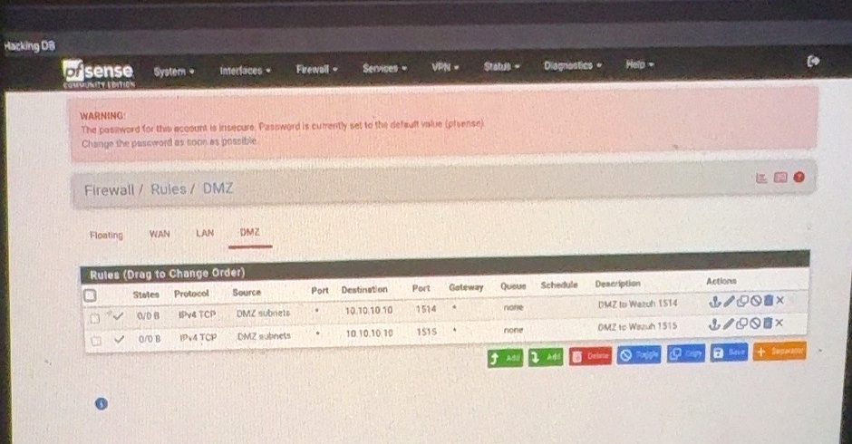
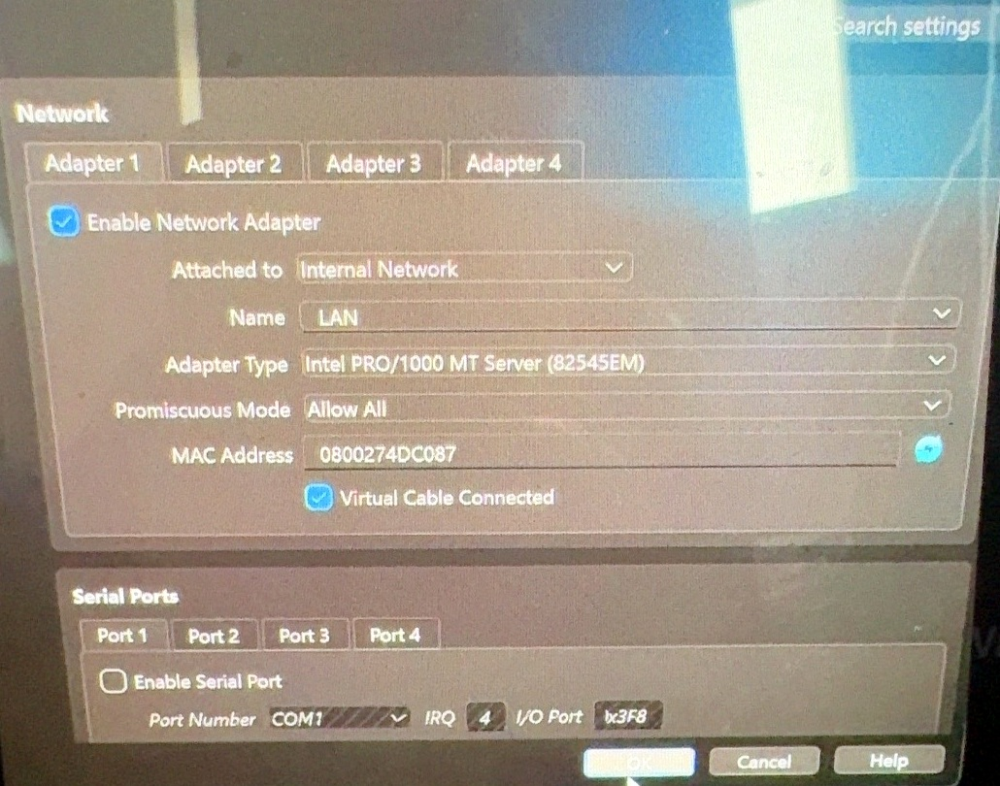
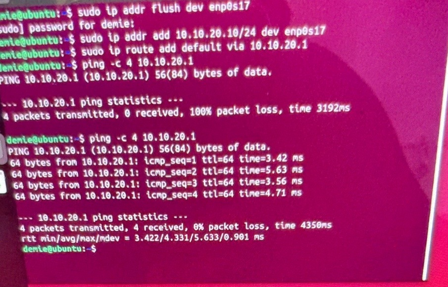
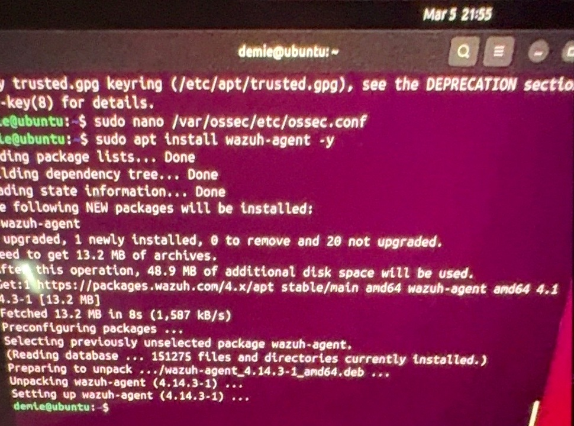
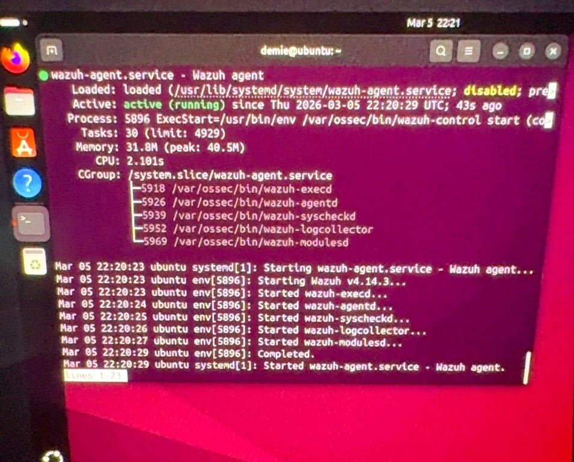
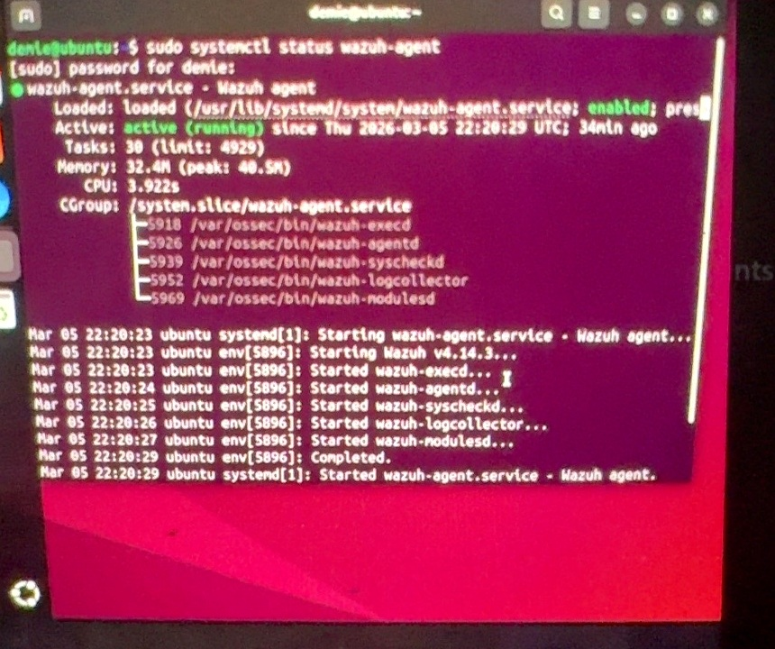
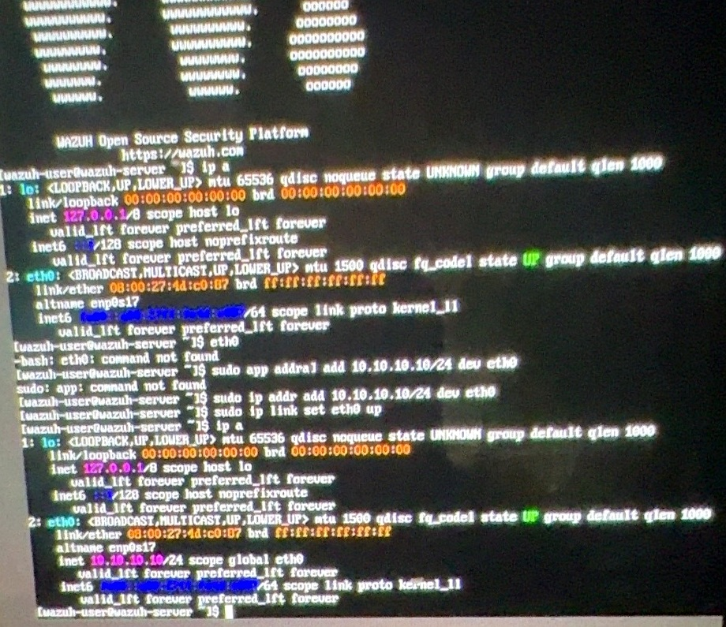
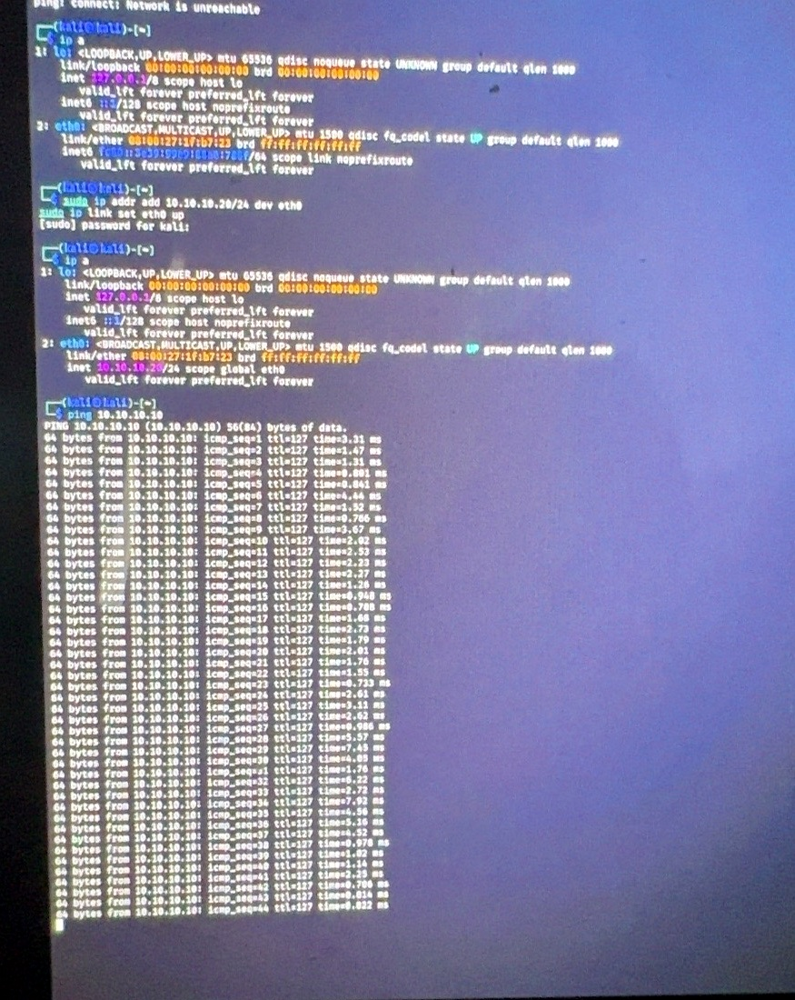
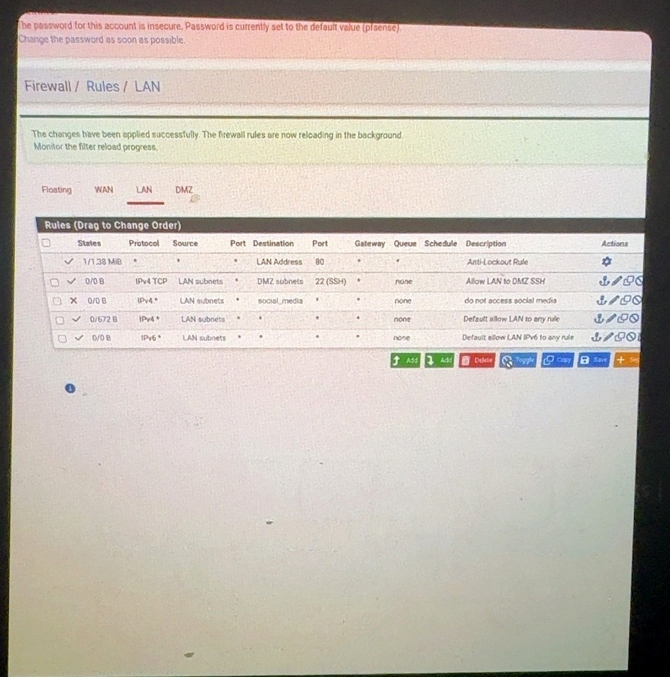
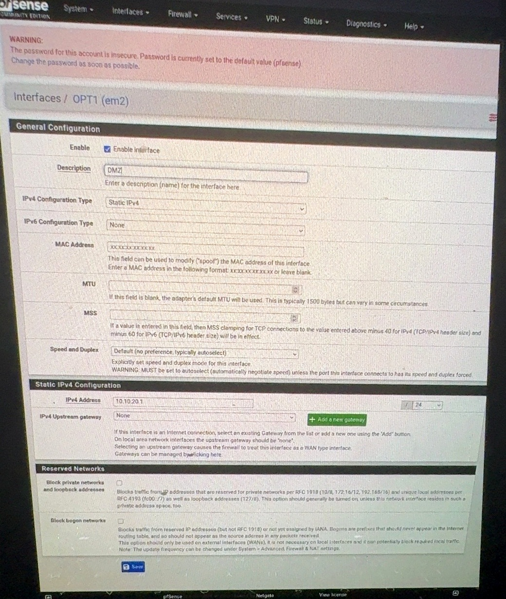

# 🛡️ SOC & Wazuh Threat Detection Lab

## 📌 Project Overview

This project documents a hands-on Security Operations Centre (SOC) lab built to develop practical skills in security monitoring, threat detection, network segmentation, alert analysis, and incident response.

The lab uses **Wazuh as the SIEM/XDR platform**, with a virtualised network environment designed to simulate security events and observe how suspicious activity is detected and investigated.

---

## 🎯 Objectives

The objectives of this project were to:

- Build a virtual SOC monitoring environment
- Configure Wazuh for endpoint monitoring and security-event detection
- Understand how security events are collected and analysed
- Simulate suspicious network and authentication activity
- Investigate security alerts generated by Wazuh
- Explore network segmentation using pfSense
- Develop practical SOC investigation and incident-response skills

---

## 🏗️ Lab Environment

The environment was created using **VirtualBox** and included separate network segments.

### Systems Used

| System | Purpose |
|---|---|
| Wazuh | Security monitoring, log analysis and alert generation |
| Kali Linux | Security testing and simulated attack activity |
| Ubuntu | Monitored endpoint / DMZ system |
| pfSense | Firewall, routing and network segmentation |
| VirtualBox | Virtualisation platform |

### Network Design

The lab included:

- **LAN:** `192.168.10.0/24`
- **DMZ:** `192.168.20.0/24`
- Wazuh monitoring infrastructure
- Kali Linux security-testing machine
- Ubuntu system within the DMZ
- pfSense controlling traffic between network segments

---

## 🔍 Threat Simulation

Controlled security events were generated within the lab environment to understand how suspicious behaviour appears within a monitoring platform.

Activities included:

- Repeated SSH authentication attempts
- FTP authentication activity
- Failed login attempts
- Testing authentication activity against the username `admin`
- Reviewing unusual login activity

> All security testing was performed within an isolated lab environment for educational purposes.

---

## 🚨 Detection & Investigation

Using the Wazuh dashboard, I reviewed alerts generated by the monitored systems and examined information such as:

- Alert severity
- Authentication failures
- Source and destination information
- User accounts involved
- Timestamps
- Repeated login attempts
- Relevant security logs

This helped me understand how raw system activity can be transformed into actionable security alerts for investigation.

---

## 🧠 Investigation Approach

My basic SOC investigation workflow involved:

**1. Detect** → Identify the Wazuh alert  
**2. Validate** → Review the event and supporting logs  
**3. Investigate** → Examine the source, user, timestamp and activity pattern  
**4. Assess** → Determine whether the behaviour could represent suspicious activity  
**5. Respond** → Consider appropriate containment or remediation actions  
**6. Document** → Record findings and security recommendations

---

## 🔐 Security Recommendations

Based on the scenarios explored in the lab, potential defensive measures included:

- Implementing strong password policies
- Limiting unnecessary SSH and FTP access
- Monitoring repeated authentication failures
- Applying firewall rules between network segments
- Using network segmentation to limit lateral movement
- Reviewing high-severity Wazuh alerts promptly
- Disabling unnecessary services
- Maintaining centralised security logging

---

## 🛠️ Skills Demonstrated

- SIEM Monitoring
- Wazuh
- Security Event Analysis
- Log Analysis
- Threat Detection
- Incident Investigation
- Network Security
- pfSense
- Linux
- Kali Linux
- Network Segmentation
- VirtualBox
- Basic Incident Response

---

## 📸 Project Evidence

The following screenshots document the implementation, configuration, connectivity testing, Wazuh deployment, and troubleshooting completed during the lab.

### 🔥 pfSense Firewall Configuration

Firewall rules were configured in pfSense to control communication between the segmented lab networks and the Wazuh monitoring infrastructure.

### 🌐 Virtual Network Configuration

VirtualBox networking was configured to provide isolated virtual network segments for the SOC lab environment.

### 🖥️ DMZ Connectivity Testing

Connectivity testing was performed from the DMZ endpoint to verify communication across the configured virtual network.

### 🛡️ Wazuh Agent Deployment

The Wazuh agent was installed and configured on the monitored endpoint.

### 🔧 Wazuh Enrollment Troubleshooting

Agent enrollment and connectivity issues were investigated as part of the deployment and troubleshooting process.

### ✅ Wazuh Agent Running

The Wazuh agent service was verified during endpoint configuration.

### 🖥️ Wazuh Server Network Configuration

The Wazuh server was configured on the internal monitoring network to support communication with monitored endpoints.

### 🔍 Kali-to-Wazuh Connectivity

Network connectivity between the Kali Linux system and Wazuh infrastructure was tested to validate the lab configuration.

### 🔐 LAN Firewall Rules

LAN firewall policies were implemented in pfSense, including controlled SSH access between the LAN and DMZ segments.

### 🌐 DMZ Interface Configuration

The pfSense DMZ interface was configured with a dedicated subnet to demonstrate network segmentation within the SOC lab.

---

## 📚 Key Takeaways

This project strengthened my understanding of how a SOC uses security monitoring tools to identify and investigate suspicious activity.

It also gave me practical exposure to the relationship between **network architecture, endpoint monitoring, log analysis, threat detection and incident response**.

---

## ⚠️ Disclaimer

This project was completed in a controlled virtual lab environment for cybersecurity training and educational purposes. No testing was performed against systems without authorisation.
